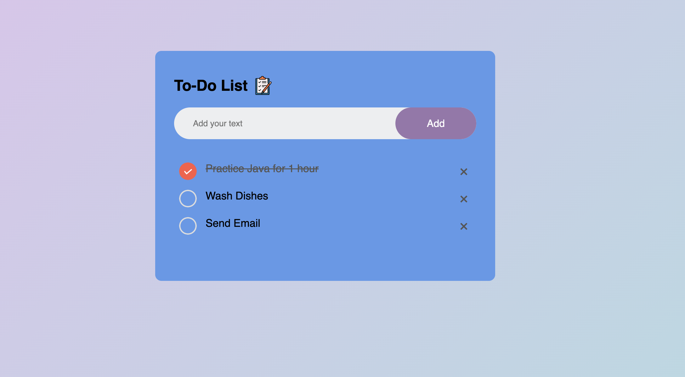

# Task-App

A simple and interactive To-Do List web application that allows users to add, check, and remove tasks. The app saves tasks using `localStorage` so that they persist across sessions.

## Features

- **Add tasks**: Users can enter a task and click the "Add" button to include it in the list.
- **Mark tasks as completed**: Clicking on a task marks it as completed with a strikethrough effect.
- **Delete tasks**: Users can remove tasks by clicking the delete button (×).
- **Persistent storage**: The app uses `localStorage` to save tasks, ensuring they remain even after refreshing the page.

## Languages Used

- **HTML**: For the app structure.
- **CSS**: For styling the UI.
- **JavaScript**: To handle interactivity and data persistence.

## File Structure

- `index.html` – Main HTML file that renders the to-do list.
- `style.css` – Styles the to-do list for a visually appealing UI.
- `script.js` – Handles the logic for adding, removing, and storing tasks.

Reference: GreatStack
